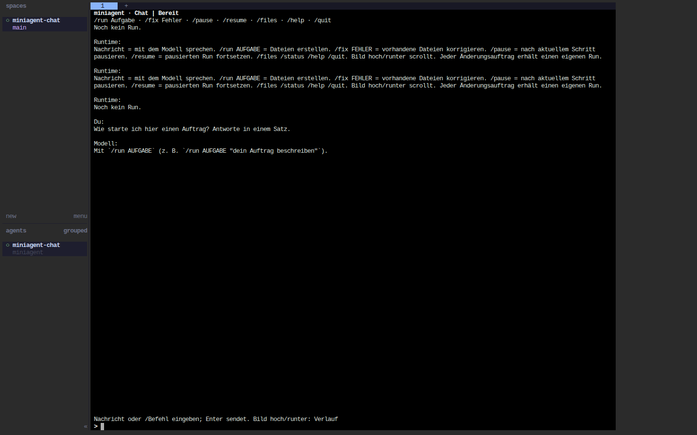

# Chat-TUI mit Herdr und Browserzugang

miniagent hat eine kleine `curses`-TUI ohne zusätzliche Python-UI-Abhängigkeit.
Herdr besitzt die Terminal-Sitzung und zeigt miniagent im Agentenbereich an.
Für den Browserzugang dient **ttyd als lokale Terminal-Brücke**:

```text
Browser → ttyd (127.0.0.1:7681) → Herdr → miniagent Chat-TUI
                                           ├─ Gespräch → lokales Modell
                                           └─ /run, /fix → Plan → Gates → Tools → Prüfungen
```

Herdr selbst dokumentiert einen Terminal-Multiplexer, keine eingebaute Weboberfläche.
Die Website `herdr.dev` hostet diesen Chat nicht. Quellen:
[Herdr Quick Start](https://herdr.dev/docs/quick-start/),
[Herdr Socket API](https://herdr.dev/docs/socket-api/),
[ttyd-Handbuch](https://github.com/tsl0922/ttyd/blob/main/man/ttyd.man.md).

## Auf diesem Rechner starten

Herdr **0.9.0** und ttyd **1.7.7-40e79c7** liegen bereits unter `.cache/bin/`.
Der Herdr-Download wurde gegen das Hersteller-Manifest geprüft, ttyd gegen
`SHA256SUMS` aus Release 1.7.7. Die lokalen Binärdateien werden nicht mit Git verteilt.

Erstes Terminal, vorhandenes K2-Modell starten:

```bash
cd /home/krusty/TinyPilot
bash examples/start_k2.sh /home/krusty/joschka-lokal-hermes-test/models/K2-Horizon-7B-Q4_K_M.gguf
```

Zweites Terminal:

```bash
cd /home/krusty/TinyPilot
.venv/bin/python -m examples.chat.launch --web
```

Dann **http://127.0.0.1:7681** öffnen. Der Launcher startet bei Bedarf eine eigene
Herdr-Sitzung `miniagent`, öffnet dort die TUI und bindet ttyd ausschließlich an
Loopback. Mit `--port 7682` lässt sich der Browser-Port ändern. Ohne `--web` hängt
der Launcher das aktuelle Terminal an Herdr an. `--name` wählt eine andere
Herdr-Sitzung; eine Chat-Sitzung sollte genau einer Herdr-Sitzung zugeordnet bleiben.

Der Launcher verwendet `.cache/herdr-chat.toml` und ändert nicht die persönliche
Herdr-Konfiguration. Beim erneuten Aufruf bleibt eine laufende Chat-Sitzung bestehen.
Neue Sitzungen verwenden standardmäßig das
[Tetris-Profil](../examples/tetris_html/chat.toml). Bereits bestehende Sitzungen
verwenden ihre gespeicherten Werte.

Beim Entwicklungsversuch am 9. September 2026 brach der K2-CUDA-Server mit
`unspecified launch failure` ab. Danach erkannte `nvidia-smi` die GPU nicht mehr,
obwohl sie noch per PCI sichtbar war. Die TUI bleibt ohne Modellserver bedienbar,
aber neue Modellantworten benötigen einen wieder verfügbaren Backend-Prozess.
Es wurde kein GPU-Reset oder Rechnerneustart automatisch ausgeführt.

## Bedienung

| Eingabe | Wirkung |
|---|---|
| Normale Nachricht | Gespräch mit dem lokalen Modell, ohne Tool-Ausführung |
| `/run Erstelle Tetris gemäß SPEC.md` | Neuer Run aus dem konfigurierten Eingabe-Workspace |
| `/fix Beim Neustart bleiben Blöcke liegen` | Neuer Korrektur-Run mit den Dateien des letzten Runs |
| `/pause` oder Strg+C | Nach dem laufenden Runtime-Schritt pausieren |
| `/resume` | Den pausierten Run mit unverändertem Goal und Budget fortsetzen |
| `/status` | Aktueller Schritt, Tool-/Modellaufrufe und Reparaturen |
| `/files` | Vollständige Pfade der vorgesehenen Ausgabedateien |
| `/help` | Kurzhilfe |
| `/quit` | TUI beenden, sobald kein Auftrag mehr läuft |

Bild hoch/runter scrollt; Strg+U leert die Eingabe. Während ein Auftrag läuft,
zuerst `/pause` verwenden, dann die nächste Nachricht schicken. Ein laufender
Modellaufruf wird dabei einschließlich seiner geprüften Aktion zu Ende geführt.
Der Parser und die Gates bleiben aktiv.
Schreib-/Prüfoperationen werden nicht mitten in der Ausführung abgebrochen.

Ein Korrekturauftrag verändert kein altes Goal: `/fix` kopiert den letzten Workspace
in einen neuen Run und speichert das bisherige Goal mit der expliziten Rückmeldung
als neues Goal. `/run` beginnt erneut mit dem konfigurierten Eingabe-Workspace.
Normale Chat-Antworten können auch JSON oder Code enthalten; das führt zu keinem
Tool-Aufruf. Konfigurierte Verifikationsbefehle entscheiden über einen Run-Abschluss.

Browser schließen oder neu laden trennt nur den Herdr-Client; die TUI bleibt in
Herdr erhalten. Strg+C im Launcher-Terminal beendet ttyd, nicht die Herdr-Sitzung.
Zum bewussten Beenden aller Prozesse in dieser Herdr-Sitzung:

```bash
.cache/bin/herdr --session miniagent server stop
```

## Eigene Aufgaben und Konfiguration

Die TUI läuft auch direkt, ohne Herdr oder Browser-Brücke:

```bash
.venv/bin/miniagent tui --session runs/chat/html --output index.html
```

Mehrere `--output`-Angaben erlauben mehrere Dateien. `--workspace` kopiert ein
Eingabeverzeichnis; das Chat-Verzeichnis muss außerhalb dieses Eingabeverzeichnisses
liegen. `SPEC.md` ist die erforderliche Eingabedatei und wird bei Bedarf aus der
Aufgabe erzeugt. `--backend transformers` verwendet das vorhandene Transformers-
Backend; für GGUF ist `llama` mit Port 18089 voreingestellt.

`--config` akzeptiert `[model]`, `[limits]`, `[runtime]`, `[tools]` sowie:

```toml
[chat]
backend = "llama"
port = 18089
source = "task" # relativ zur Konfigurationsdatei

[tools]
write_paths = ["engine.js", "tetris.html"]
required_verifications = ["engine", "ui"]

[tools.commands]
engine = ["/usr/bin/node", "{config_dir}/verify.mjs", "--engine"]
ui = ["/usr/bin/node", "{config_dir}/verify.mjs", "--ui"]

[runtime]
planning_strategy = "files"
execute_plan = true
repair_strategy = "rewrite"
repair_edit = "replace"

[runtime.repair_by_command]
engine = ["engine.js"]
ui = ["tetris.html"]

[limits]
max_replans = 40
max_iterations = 250
max_tool_calls = 200
max_tokens = 1000000
max_runtime_seconds = 1800.0
```

Nur die Chat-Konfigurationshilfe expandiert `{config_dir}`; es wird keine Shell
gestartet. Ausführbare Programme sollten als absolute Pfade angegeben werden.
Die normalen Runtime-Gates prüfen auch die gezielt ausgewählten Reparaturdateien.
Nach jeder Änderung werden alle erforderlichen Prüfungen erneut eingeplant.

`repair_edit = "replace"` funktioniert für beliebige Textdateien. Das Modell liefert
zwei Code-Fences, `before` und `after`. `before` muss exakt einmal im aktuellen Inhalt
vorkommen; unveränderte und mehrdeutige Ersetzungen werden abgewiesen. Als Recovery
werden zwei gleich beschriftete Fences ebenfalls in dieser Reihenfolge interpretiert.
Der erwartete Datei-Hash schützt gegen zwischenzeitliche Änderungen. Der neue Inhalt
durchläuft dieselben Pfad-, Argument- und Execution-Gates wie jede andere Schreibaktion.

## Persistenz und Grenzen

```text
runs/chat/tetris/
├── session.json  # Backend, Policy, Limits, letzter Run und letzte 40 Nachrichten
├── chat.jsonl    # dauerhaftes Gesprächsprotokoll
└── runs/        # normale, eigenständige miniagent-Runs
```

Die Sitzung ist gegen parallele Writer gesperrt. Nach Neustart genügt derselbe
`--session`-Pfad ohne Setup-Flags. Neue Konfigurationen verwenden einen neuen
Sitzungspfad; vorhandene Werte werden nicht still überschrieben. Der Chat-Prompt
enthält höchstens sechs gekürzte Nachrichten, die aktuelle Nachricht und den
Run-Status. Agent-Runs verwenden weiterhin ihren eigenen kompakten State-Kontext.
Chat-Antworten unterliegen den Modellgrenzen pro Aufruf; Run-Gesamtbudgets zählen
die Ausführung des jeweiligen Agent-Runs, nicht das gesamte Gespräch.

## Prüfung

Geprüft wurden echte Browsereingaben durch ttyd und Herdr, Wiederverbindung nach
Neuladen sowie eine echte K2-Chat-Antwort. Die Sidebar zeigte miniagent als eigenen
Agenten. Unit-Tests prüfen zusätzlich: Chat ohne Toolausführung, explizite neue
Goals bei `/fix`, Pausieren/Fortsetzen ohne wiederholtes Schreiben, Dateihashes,
gezielte Reparaturplanung, Konfiguration und Sitzungssperren.



Auf anderen Rechnern Herdr nach der
[Installationsanleitung](https://herdr.dev/docs/install/) installieren; ttyd über
die [offiziellen Releases](https://github.com/tsl0922/ttyd/releases).
Beide Programme können im `PATH` oder unter `.cache/bin/` liegen. Sie sind optionale
Darstellungswerkzeuge und keine Runtime-Core-Abhängigkeiten.
