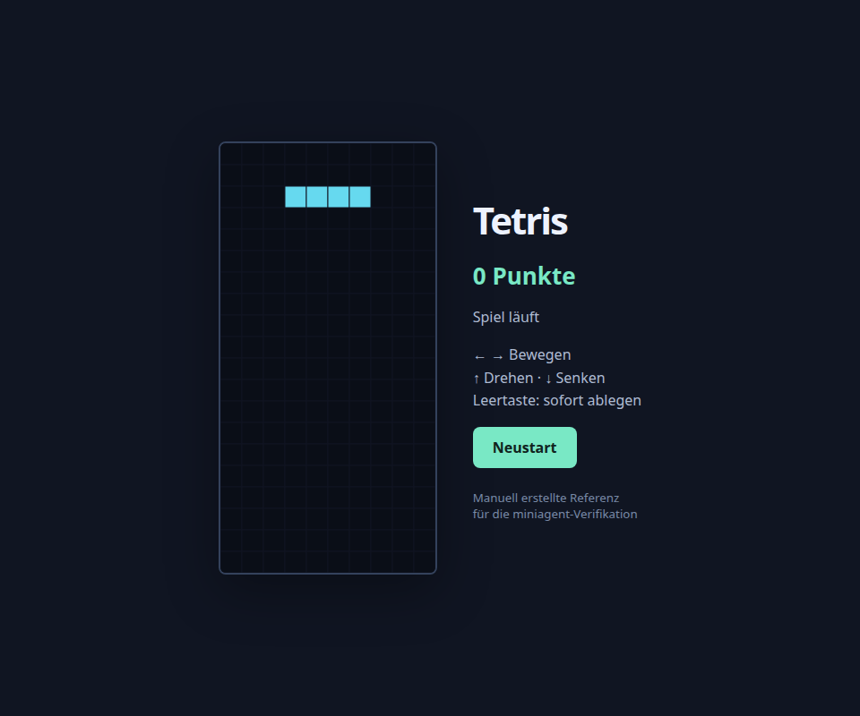

# Spielbare Tetris-Referenz

Diese Version wurde **manuell vom Coding-Assistenten erstellt**. Sie ist eine positive
Referenz für die funktionalen Prüfungen und kein autonom generiertes Agent-Ergebnis.
Das ursprüngliche fehlerhafte Modellartefakt liegt unverändert eine Ebene höher.

```bash
xdg-open examples/tetris_html/reference/tetris.html
```

`tetris.html` und `engine.js` müssen im selben Verzeichnis liegen. Es gibt keine
Netzwerkabhängigkeiten. Pfeiltasten bewegen/drehen/senken, Leertaste legt sofort ab;
vollständige Reihen geben jeweils 100 Punkte. Neustart setzt das Spiel zurück.



## Geprüft

Alle **14 Vertragsprüfungen** bestehen: sieben Standard-Tetrominos, Spielfeldzustand,
Kollisionen, Senken und Verriegeln, Rotation, Hard Drop, Reihenabbau, Punkte, Game Over,
Reset sowie die HTML-Anbindung einschließlich Schwerkraft bei normalen Bildraten.
Mutierte Varianten mit falscher Punktevergabe oder vertauschten Zeichenkoordinaten
werden vom Verifier abgewiesen.

```bash
cd examples/tetris_html/reference
node ../verify.mjs
```

Zusätzlich wurden **neun Interaktionen im echten Chromium** geprüft: Schwerkraft,
links/rechts, Rotation, Hard Drop, Reihenabbau, Punkteanzeige, Game Over, Neustart
und erneut laufende Schwerkraft. Keine JavaScript-Seitenfehler wurden beobachtet.
[Browser-Testbericht](browser_result.json).

Wiederholung mit dem optionalen Playwright-Testwerkzeug und vorhandenem Chromium:

```bash
.venv/bin/python examples/tetris_html/browser_check.py \
  examples/tetris_html/reference/tetris.html \
  --chromium /home/krusty/.cache/ms-playwright/chromium-1234/chrome-linux64/chrome
```

Playwright 1.62.0 wurde ausschließlich für Entwicklungsprüfungen installiert und
ist keine Runtime-Core-Abhängigkeit. Der Browser-Test wurde mit Chromium
151.0.7922.34 ausgeführt. Es wurden keine Browser- oder Modellgewichte heruntergeladen.
